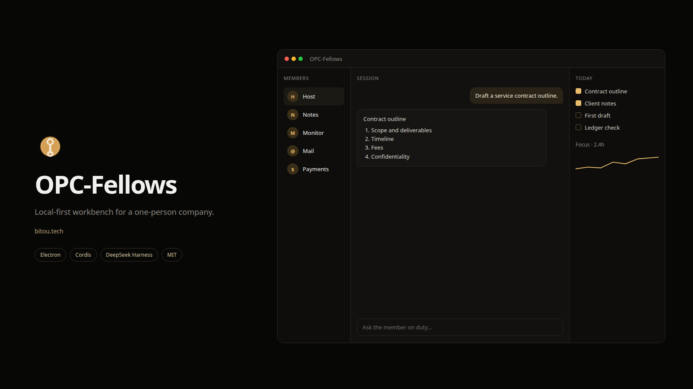

<p align="center">
  
</p>

<p align="center">
  <strong>OPC-Fellows</strong> · 一人公司的本地优先工作台<br>
  内核提供外壳、待办与模块契约，职业能力以插件挂上。
</p>

<p align="center">
  <a href="README.md">English</a> · <a href="README.zh-CN.md">中文</a>
</p>

<p align="center">
  <a href="https://github.com/Alfred-Lau/OPC-Fellows/stargazers"></a>
  <a href="https://github.com/Alfred-Lau/OPC-Fellows/actions/workflows/ci.yml"></a>
  <a href="https://github.com/topics/dsh-plugin"></a>
  <a href="https://github.com/deepseek-ai/deepseek-harness"></a>
  <a href="https://github.com/cordiverse/cordis"></a>
  <a href="https://www.electronjs.org/"></a>
  <a href="LICENSE"></a>
</p>

<p align="center">
  <a href="#定位">定位</a> ·
  <a href="#快速开始">快速开始</a> ·
  <a href="#写一个模块">写一个模块</a> ·
  <a href="#内置模块参考实现">内置模块</a> ·
  <a href="#架构">架构</a> ·
  <a href="#生态">生态</a> ·
  <a href="#贡献">贡献</a> ·
  <a href="#开源与治理">开源与治理</a>
</p>

A local-first Electron workbench for a one-person company: a small kernel (shell, todos, module contract) plus occupation plugins. Built on [Cordis](https://github.com/cordiverse/cordis) / [DeepSeek Harness](https://github.com/deepseek-ai/deepseek-harness).

> 产品目录、社媒签名、作者名等业务数据由用户在「工作情况」和模块设置里填写，仓库默认值为空。

## 定位

一人公司只有一张工作台。用户先选**成员**（职业身份）或**项目**（一件多人合作的事），在会话里推进，右侧是该身份正在盯的 Panel。新功能加模块，不改内核联合类型。

| 概念 | 含义 |
| --- | --- |
| **内核** | 不可禁用：外壳、待办、搜索、设置、模块仓库、成员 / 项目 |
| **模块** | 一份 Cordis 插件 + 一份 manifest。可 enable / disable，第三方可从本地目录或 Git 安装 |
| **成员** | 模块的一次具身：人设、主 Panel、推荐 Skill。界面不写 Agent |
| **待办** | 内核服务。任意模块经 `todos.ingestAgent` 写入，按 `dedupeKey` 去重 |

约定见 [CONTEXT.md](CONTEXT.md)，模块化设计见 [docs/module-architecture-design.md](docs/module-architecture-design.md)。

### 为什么这样拆

对照 [dsh-plugin](https://github.com/topics/dsh-plugin) 上的爆款桌面工作台（[OpenDesign](https://github.com/nexu-io/open-design)、[iPolloWork](https://github.com/Devin-AXIS/iPolloWork)、[dsh-desktop](https://github.com/anywhere-labs/dsh-desktop)、[dsh-web](https://github.com/zhu1090093659/dsh-web)）：它们把 **Harness 当运行时、把能力当插件**。OPC-Fellows 的目标同一条路，外壳是一人公司的花名册，不是再做一个 dsh web 皮肤。

H1–H8 已让中栏闲聊走 `dsh --profile opc`。随手记 `notes_add` 挂在 opc 的 dsh `ctx.tools` 上；收款 / 监控 / 选品仍由 Electron `ctx.tools` 执行。见 [ADR 0005](docs/adr/0005-dsh-as-composition-host.md)。

- **本地优先**：业务数据在本机 `userData`，模型密钥在「设置 → 模型」走 `safeStorage`
- **万物可插**：职业、Panel、Skill 都是模块；内核只保留契约
- **权限白名单**：模块只能调用 manifest 声明的 capability，高危项安装前确认
- **契约对齐 dsh**：`apply(ctx)`、package.json 自定义字段、capability 分层，方便从 Harness 生态平移

## 主干会带走什么

抽仓库时，开源主干只保留通用层。个人业务数据走配置，不进默认代码。

```
src/kernel/          主干：启动、IPC 桥、存储、待办、导航、模块仓库、成员
src/modules/         内置职业（参考实现，开源仓库会做成可选包或示例）
examples/            第三方模块最小示例
docs/                架构与 ADR
```

| 留下（主干） | 不进主干默认值 |
| --- | --- |
| 模块契约、capability、仓库安装 | 个人站点清单（工作情况里自填） |
| 待办 / 提醒 / Agent 收件箱 | 社媒签名、公众号作者、扣子工作流 ID |
| 本机存储与 `safeStorage` | 打包签名身份、公证 Team ID |
| `examples/hello-module` | 真实产品目录（示例见 `examples/catalog.example.json`） |

凭据只走环境变量或本机 `safeStorage`（设置 → 模型），仓库里没有硬编码 key。仍可读 `~/.dsh` 遗留配置，但新填写请走设置页。启动后产品目录、社媒签名、公众号作者都是空的，要自己在「工作情况」和各模块设置里填。示例目录见 [`examples/catalog.example.json`](examples/catalog.example.json)。

## 快速开始

需要 Node.js `^22.19.0` 或 `>=24.0.0`，pnpm 10+。Electron 42+ 不再在自身 `postinstall` 里拉二进制，本仓库用 `postinstall: install-electron` 在依赖装完后下载，所以第一次 `pnpm install` 会多等一会儿。

```sh
pnpm install
pnpm dev
```

启动后工作台默认最大化。

可选：

```sh
export DEEPSEEK_API_KEY=sk-...   # 可选；覆盖「设置 → 模型」里保存的 key
pnpm test                        # 内核与 shared 单测
pnpm dsh                         # 本机 DeepSeek Harness CLI
```

打包：`pnpm pack`（目录）、`pnpm dist`，或 macOS 签名安装包 `pnpm dist:mac`。

## 写一个模块

第三方模块是一个 npm 包。桌面工作台读 `ownworkbuddy` 字段（主进程 `apply(ctx)`，可选 UI `mount(root, api)`）；Agent 运行时读官方 `dsh.bundle`。过渡期两份都写。不必改 preload。

仓库里有最小示例 [`examples/hello-module`](examples/hello-module)：

```json
{
  "main": "dsh-plugin.js",
  "ownworkbuddy": {
    "id": "hello",
    "title": "你好",
    "kind": "view",
    "main": "index.js",
    "capabilities": [],
    "ui": "ui.js"
  },
  "dsh": {
    "bundle": { "patch": "./cordis.patch.yml" }
  }
}
```

```js
export default function apply(ctx) {
  ctx.workbench.nav({ id: 'hello', title: '你好', mark: '你', kind: 'view', order: 200 })
  ctx.bridge.handle('hello:ping', () => ({ ok: true, at: new Date().toISOString() }))
}
```

工作台「扩展」页可从本地目录或 Git 安装。进 dsh 层栈用官方 CLI（会初始化 `$DSH_HOME/profiles/opc`）：

```sh
pnpm dsh plugin --profile opc add ./examples/hello-module
pnpm dsh plugin --profile opc add ./packages/opc-kernel
pnpm dsh plugin --profile opc add ./packages/occupation-notes
pnpm dsh plugin --profile opc add ./packages/occupation-monitor
pnpm dsh plugin --profile opc add ./packages/occupation-payments
pnpm dsh plugin --profile opc add ./packages/occupation-micro
```

工作台里停用带 `dsh.bundle` 的模块（含随手记 / 监控 / 收款 / 选品）时，会在 opc profile 的 `cordis.patch.yml` 加上 `{ id: opc-<模块>, disabled: true }`。

模块只能使用 manifest 里声明的 capability（`storage` / `todos:write` / `secrets` / `subprocess` …），未声明的调用会被内核拒绝。`subprocess` 与 `secrets` 安装时会单独提示。

内置模块构建期静态注册（`builtin:<id>`），避开 asar 动态 import 限制。模块之间不要直连 store，跨模块只走内核服务。

## 内置模块（参考实现）

这些是当前产品里的职业，用来验证契约，不是主干的一部分。没配密钥时降级为本地功能，不发未认证请求。

| 模块 | 做什么 |
| --- | --- |
| 随手记 | 本机笔记 |
| 台伴 | 独立窗提醒；待办到点跳到屏幕中间 |
| 项目监控 | 仓库 / 站点态势；可选拉取站点 `GET /api/stats` |
| 社媒弹药 | 按产品能力生成多平台文案 |
| Micro 选品 | 从公开论坛捞痛点，聚成产品 idea |
| 增长黑客 | 实验、增长环与渠道表；不写文案、不刷新流量 |
| 自媒体账号 | 国内平台账号与日记（数据手录） |
| 微信情报 | 本机只读对接 [WeChat Intelligence Hub](https://github.com/Rion-Wu-tech/wechat-intelligence-hub)；不发微信、聊天不出本机 |
| 邮件整理 | 本机「邮件」+ iCloud / Gmail / QQ IMAP；只整理、写草稿，不代发 |
| 收款管理 | 本机台账；可选同步 [Creem](https://creem.io) |
| DeepSeek Harness | 中栏对话与 Local API 共用 SDK session；不当可雇职业，不再起官方 UI |

站点统计、选品代理、Creem key 等都是**模块配置**，详见各模块设置页。环境变量备忘：

| 变量 | 用途 |
| --- | --- |
| `DEEPSEEK_API_KEY` | LLM（覆盖「设置 → 模型」；仍可读 `~/.dsh` 遗留） |
| `OPC_USER_DATA` | 工作台传给 opc 子进程的 userData（随手记 `notes.json`） |
| `OWNWORKBUDDY_STATS_KEY` | 项目监控请求站点 `/api/stats` 的共享密钥 |
| `CREEM_API_KEY` | 收款模块覆盖本机保存的 key |
| `HTTPS_PROXY` | 选品扫描走代理（国内访问 Reddit 时） |

## 架构

```
目标（ADR 0005）
  Electron 薄壳（窗 / 托盘 / 台伴）
    dsh --profile opc
      dsh-base（llm / tools / sessions / agent-loop）
      OPC 内核 bundle（todos、成员、项目）
      职业 bundle → ctx.tools + 右栏 Panel

现状（H8）
  Electron 主进程
    applyOpcKernel（cordis.patch.yml 顺序）
      服务：modules / workbench / bridge / storage / secrets
            todos / llm / tools / dshRuntime / scheduler / notify / search / repository / agents
      内置模块（in-process）+ 已装第三方模块
        notes_add：dsh ctx.tools（occupation-notes）+ Electron JSON 退路
        monitor_refresh / payments_sync / micro_scan → Electron ctx.tools
    同一 dsh --profile opc：中栏闲聊与 Local API /agent/task（in-box 含 dsh-sdk-app）
    `$DSH_HOME/profiles/opc`：occupation-* + 第三方 dsh.bundle；工作台停用回写用户 patch
    Completions 只走 ctx.llm（拆解 / 选品润色 / 弹药 / 公众号）
  preload：workbench.invoke / subscribe（按模块校验）
  渲染进程：左栏成员与项目 · 中栏会话 · 右栏 Panel
```

外壳心智（成员 / 项目 / Skill，而不是侧栏功能页）见 [docs/agent-workspace-design.md](docs/agent-workspace-design.md)。运行时宿主见 [docs/adr/0005-dsh-as-composition-host.md](docs/adr/0005-dsh-as-composition-host.md)。

## 生态

模块契约对齐 DeepSeek Harness 社区约定。发现、安装、对照实现时，优先看官方话题和星标靠前的桌面 / 插件项目：

| 项目 | 星标量级 | 和本仓库的关系 |
| --- | --- | --- |
| [deepseek-ai/deepseek-harness](https://github.com/deepseek-ai/deepseek-harness) | 运行时本体 | 本机 `pnpm dsh`；现状是 `dsh --profile opc` 一棵进程 |
| [nexu-io/open-design](https://github.com/nexu-io/open-design) | 设计工作台 | 同样是本地优先桌面 + dsh 一等运行时 |
| [Devin-AXIS/iPolloWork](https://github.com/Devin-AXIS/iPolloWork) | 多引擎 Agent 工作台 | 成员 / 项目 / 插件生命周期可对照 |
| [anywhere-labs/dsh-desktop](https://github.com/anywhere-labs/dsh-desktop) | DSH 桌面宿主 | 把 Harness 装进可分发客户端 |
| [zhu1090093659/dsh-web](https://github.com/zhu1090093659/dsh-web) | Web GUI 插件全家桶 | 任务看板、远程、皮肤的插件切法 |
| [liustack/modlens](https://github.com/liustack/modlens) | 视觉插件 | 单能力插件的 README / 安装体验 |
| [dsh-market/dsh-market](https://github.com/dsh-market/dsh-market) | 应用内插件市场 | 扩展页的发现与一键安装可对照 |
| [awesome-dsh-plugin/awesome-dsh-plugin](https://github.com/awesome-dsh-plugin/awesome-dsh-plugin) | 精选列表 | 社区插件目录 |

完整列表：[github.com/topics/dsh-plugin](https://github.com/topics/dsh-plugin)。

## 开源与治理

本仓库即公开主干：[Alfred-Lau/OPC-Fellows](https://github.com/Alfred-Lau/OPC-Fellows)。仓库首页默认展示 [英文 README](README.md)。

1. 内核、模块 SDK、示例模块与治理文件随仓库提供；真实目录默认值不进仓库。
2. [MIT License](LICENSE)，对齐 Cordis / dsh。
3. 贡献见 [CONTRIBUTING.md](CONTRIBUTING.md) / [CONTRIBUTING.en.md](CONTRIBUTING.en.md)，安全见 [SECURITY.md](SECURITY.md)。界面国际化方案见 [docs/i18n-plan.md](docs/i18n-plan.md)。
4. 打包签名身份走环境变量；不要上传已签名的 `.app` / `.dmg`。

欢迎对**主干契约**提 PR：内核服务、模块 manifest、capability、示例模块、文档。不要把真实站点、签名或密钥默认值加进 `src/shared`。

## 贡献

- [贡献指南](CONTRIBUTING.md) · [Contributing (English)](CONTRIBUTING.en.md)
- [行为准则](CODE_OF_CONDUCT.md)
- [安全披露](SECURITY.md)
- 好上手的第一刀：补英文词条、写 `examples/` 模块、给某个职业加测试、给 Issue 标 `good first issue`

提交即按 [MIT License](LICENSE) 授权给本项目。版权声明见许可证全文。

## 安全

- 业务数据在本机 `userData`，不经过项目自己的服务器。
- 微信情报只读本机索引，不上传聊天、不把 key 送出本机、不代发消息。
- 邮件整理只读收件箱并写本机草稿；线上邮箱用专用密码，走 `safeStorage`，不代发。
- 第三方模块按 capability 白名单运行；高危权限安装前确认。
- 发现漏洞请走 [SECURITY.md](SECURITY.md)，不要在公开 Issue 里贴凭据或用户数据。

## 许可与致谢

[MIT License](LICENSE)。运行时依赖 [Cordis](https://github.com/cordiverse/cordis) 与 [DeepSeek Harness](https://github.com/deepseek-ai/deepseek-harness)。封面与徽章对齐 [dsh-plugin](https://github.com/topics/dsh-plugin) 生态里桌面工作台的常见呈现。

作者 [bitou.tech](https://pen.bitou.tech/)。想一起改主干，见 [CONTRIBUTING.md](CONTRIBUTING.md)。
